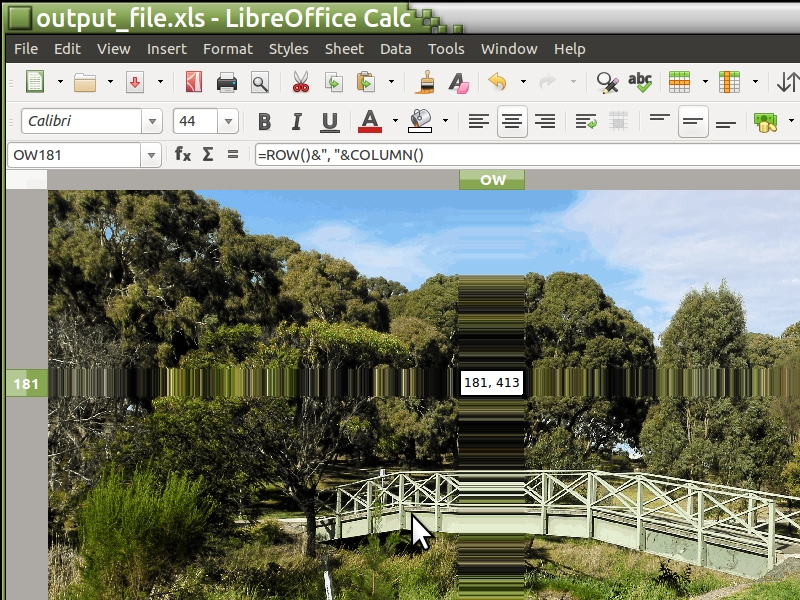

# Image to colored cells Excel file

## This Python code loads an image and generates an XLS file with coloured cells.

The source image must be called "input_image.jpg" and the result file is called "output_file.xls". 
The generated files open correctly in LibreOffice, havent tested in Excel but should work based on the library.
The code does the following:

1) The image is loaded and reduced in colours since spreadsheets have a low limit of colours per file.
2) The image is reduced in size to match the maximum rows and columns. Reduction is applied only if required, and is proportional to the original width and height of the image to keep the ratio.
3) Then colours from final image are indexed and coded to spreadsheet format
4) The pixels are now processed and the file is generated with the appropriate formatting

Example.. from this 3464x1840 image

The XLS file is generated with square colums and rows

When zooming out the image start to appeared

Image now appeared (may appeared slightly pixeled)

Notice this is still an spreadsheet. A column or row size can be increased to demonstrate that.

This project is just for fun, to test Python, the libraries PIL and xlsxwriter, and see how the image looks at the end.

The original pictures were taken with a mobile phone camera.

## License

See the [LICENSE](LICENSE.md) file for details.

THE SOFTWARE IS PROVIDED "AS IS", WITHOUT WARRANTY OF ANY KIND, EXPRESS OR IMPLIED, INCLUDING BUT NOT LIMITED TO THE WARRANTIES OF MERCHANTABILITY, FITNESS FOR A PARTICULAR PURPOSE AND NONINFRINGEMENT. IN NO EVENT SHALL THE AUTHORS OR COPYRIGHT HOLDERS BE LIABLE FOR ANY CLAIM, DAMAGES OR OTHER LIABILITY, WHETHER IN AN ACTION OF CONTRACT, TORT OR OTHERWISE, ARISING FROM, OUT OF OR IN CONNECTION WITH THE SOFTWARE OR THE USE OR OTHER DEALINGS IN THE SOFTWARE.
